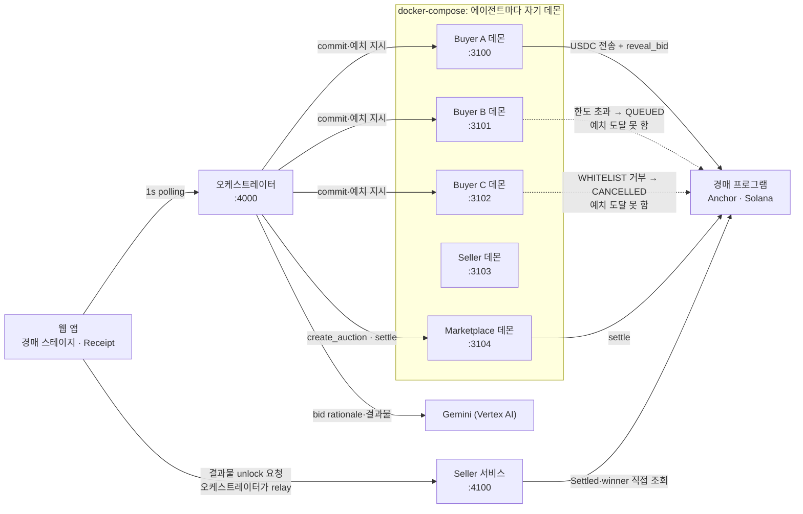

# A2AHouse: Policy-Bound A2A Auction

> **가장 높은 bid가 아니라, 권한 있는 bid가 실행됩니다.**
>
> Payment rails prove the payment happened. **WAIaaS proves the agent was allowed to pay.**

에이전트끼리 일을 사고파는 온체인 경매 데모입니다. 각 에이전트는 **자기만의 self-hosted 정책 지갑([WAIaaS](https://github.com/waiaas/WAIaaS) 데몬)** 을 가지고, 사람은 미리 위임한 예산·권한(mandate)만 정해둡니다. 그 다음부터 입찰과 예치, 정산은 사람 개입 없이 진행됩니다. **위임 범위를 벗어난 지출은 에이전트가 아무리 원해도 체결되지 않습니다.**

이 데모의 킬러 장면은 결제가 성공하는 것이 아니라 **최고가 입찰이 예치조차 하지 못하는 것**입니다.

## 라이브 데모

**<https://a2a-house.8-230-9-237.nip.io>**

Solana **devnet**에 배포해 실제로 돌립니다. 화면의 경매 개설과 입찰, 정산은 전부 실제 온체인 트랜잭션입니다. 아래 [온체인 증거](#온체인-증거)의 explorer 링크로 대조할 수 있습니다.

### 직접 해보기 — 내 지갑으로, 내 에이전트에게

**<https://a2a-house.8-230-9-237.nip.io/#me>** 에서 지갑을 연결하면 **본인 전용 에이전트 지갑**이 발급됩니다. 내가 맡긴 금액 안에서만 에이전트가 스스로 사고, 한도를 넘는 지출은 내 서명을 받아야 진행됩니다. 한도를 바꿔 같은 것을 다시 사면 **판정이 달라지는 것**을 직접 확인할 수 있습니다.

일을 맡기는 것은 MCP 도구(터미널)의 일이고, 웹은 사람이 결정하는 것(자금 위임·한도·승인)과 진행 확인을 맡습니다. 지갑이 없어도 임시 체험 지갑으로 전 과정을 볼 수 있습니다.

> **[TRY-IT.md](TRY-IT.md)** 에 단계별 안내가 있습니다(웹만 5분, MCP까지 10분).

### 발표용 고정 라운드

- `Seller` 탭에서 **경매 오픈** → `Live` 탭에서 **Start Round**를 누르면 한 라운드가 끝까지 돕니다(약 20초).
- `Owner` 탭은 데모 진행자가 씁니다(`OWNER_TOKEN` 필요). 승인 대기 큐 조회와 **거부** 버튼이 여기에 해당하고 나머지 장면은 전부 토큰 없이 동작합니다.

> 구성: GCP VM 1대에 WAIaaS 데몬 5개(docker compose) + 오케스트레이터·seller(호스트 Node) + Caddy 자동 HTTPS. 라이브 배포본의 Gemini 호출은 **Vertex AI** 백엔드로 나갑니다.

## 목차

- [라이브 데모](#라이브-데모)
- [직접 해보기](TRY-IT.md)
- [문제 정의](#문제-정의)
- [무엇을 보여주는가](#무엇을-보여주는가)
- [아키텍처](#아키텍처)
- [WAIaaS를 control plane으로 확장하기](#waiaas를-control-plane으로-확장하기)
- [온체인 증거](#온체인-증거)
- [실행 방법](#실행-방법)
- [무엇이 실물이고 무엇이 연출인가](#무엇이-실물이고-무엇이-연출인가)
- [Production hardening (로드맵)](#production-hardening-로드맵)

## 문제 정의

에이전트도 외주를 줍니다. 직접 하면 토큰 50만 개와 2시간이 드는 리서치를, 그걸 원가 10만 토큰에 더 잘하는 전문 에이전트에게 **2.80 USDC**에 시킬 수 있다면 사는 게 합리적입니다.

그런데 **그 돈이 회사 돈**입니다. 에이전트에게 지갑을 쥐여주는 순간 질문이 바뀝니다.

| 기존 결제 인프라가 답하는 것 | 답하지 못하는 것 |
| --- | --- |
| 결제가 일어났는가 | 이 에이전트가 **지출해도 되는** 돈이었는가 |
| 서명이 유효한가 | 위임한 **예산 한도** 안이었는가 |
| tx가 확정됐는가 | **누가 어떤 권한으로** 승인했는가 |

이 데모는 오른쪽 열을 온체인 물증으로 답합니다.

## 무엇을 보여주는가

buyer 에이전트 3개가 같은 리서치 슬롯 하나를 두고 경매에 참여합니다. 세 에이전트 모두 입찰 해시를 온체인에 commit하는 데는 **성공**합니다. 금액을 공개하며 USDC를 예치하는 순간 셋이 갈립니다.

| Buyer | Bid | 위임된 mandate | 예치 판정 | 왜 |
| --- | --- | --- | --- | --- |
| 📊 **A** Analyst | **2.80 USDC** | 한도 3 USDC, 경매 프로그램+vault 허용 | ✅ **ALLOW** → 낙찰 | 한도 안 + 수신처 허용됨 |
| 🚀 **B** Growth | **6.50 USDC** (최고가) | 한도 5 USDC 초과는 owner 승인 필요 | ⏸️ **APPROVAL_REQUIRED** | 한도 초과 → 승인 대기 큐 등재 |
| 🧪 **C** Experimental | 2.20 USDC | 경매 프로그램 commit만 허용, vault 지출 미위임 | ⛔ **DENY** | 수신처 WHITELIST 미등록 |

**일반 경매라면 최고가 B가 이깁니다.** 여기서는 B의 돈이 vault에 도달조차 못 하고 한도 안에 있던 A가 낙찰됩니다. 컨트랙트가 vault에서 seller에게 정산하면 **온체인 정산이 확인된 뒤에만** 결과물이 열립니다.

핵심은 세 판정이 **서로 다른 정책 게이트**에 걸린다는 데 있습니다. B는 금액 한도(`SPENDING_LIMIT`), C는 수신처 권한(`WHITELIST`)입니다.

## 아키텍처



점선은 **정책 심사에서 막혀 온체인에 도달하지 못한** 경로입니다. buyer 데몬끼리는 서로 통신하지 않습니다. 브라우저는 항상 오케스트레이터(`:4000`) 단일 오리진만 호출하고 `/slot` 요청은 오케스트레이터가 seller로 relay합니다.

**신뢰 경계**: seller 서비스는 오케스트레이터의 말을 믿지 않습니다. 체인에서 `Settled`와 `winner`를 **직접 읽어** 정산 전 접근을 차단합니다. 오케스트레이터가 정산됐다고 거짓말을 해도 결과물은 열리지 않습니다. (요청자 신원 검증은 미구현, [무엇이 실물이고 무엇이 연출인가](#무엇이-실물이고-무엇이-연출인가) 참조)

**키 격리**: 오케스트레이터와 seller는 **에이전트 지갑 키를 갖지 않습니다.** 데몬 API 호출과 읽기 전용 온체인 조회만 하고 에이전트를 대신한 서명은 전적으로 각 WAIaaS 데몬 안에서 일어납니다. 단 하나의 예외는 x402 모드([x402 결과물 unlock](#7-x402-결과물-unlock-선택))를 켰을 때 seller가 보유하는 **facilitator 키**입니다. 결제 트랜잭션의 수수료를 대납하는 인프라 키입니다. 에이전트 지갑과는 별개입니다.

**owner 인증 대행 (데모 한정)**: Owner Console의 승인 대기 거부는 relay(`POST /api/owner/reject/:txId`)로 동작합니다. 여기서 오케스트레이터가 **B 데몬의 마스터 인증을 대행**합니다. 단일 화면에서 owner 개입 장면을 시연하기 위한 구성이며 실제 운영이라면 owner가 자기 데몬의 콘솔에서 직접 수행합니다. 이 relay는 `OWNER_TOKEN`으로 인증합니다. 오케스트레이터·seller는 기본 `127.0.0.1` 바인딩이고 외부 노출(`HOST=0.0.0.0`) 시 토큰이 없으면 owner 라우트 자체가 닫힙니다(404, fail-safe). 라이브 배포본도 이 토큰 인증으로 보호됩니다.

### 경매 흐름

```
create_auction → commit_bid ×3 → [예치: USDC 전송] → reveal_bid → settle
    (marketplace)   (buyer A/B/C)      (정책 심사가 걸리는 지점)     (marketplace)
```

이 단계에서 `commit_bid`는 금액을 올리지 않습니다. **입찰 해시를 먼저 온체인에 올립니다**(commit-reveal 구조). 예치 단계에서 실제 USDC가 움직이고 **바로 여기서 각 에이전트의 정책 엔진이 판정을 내립니다.**

## WAIaaS를 control plane으로 확장하기

이 프로젝트는 WAIaaS 데몬의 기구현된 정책 엔진과 서명, 감사 로그를 그대로 쓰고 그 위에 경매 도메인을 얹었습니다. 경매 경로는 데몬을 수정하지 않고 완주합니다. x402 모드에서만 데몬 결함 1건을 만났고 우회 대신 **업스트림에 수정을 제출**했습니다([waiaas/WAIaaS#406](https://github.com/waiaas/WAIaaS/pull/406): `/v1/x402/fetch`가 Solana 서명에 RPC 클라이언트를 전달하지 않아 결제가 실패하던 문제).

| 레이어 | 구성 요소 | 상태 |
| --- | --- | --- |
| **정책·서명·감사** | WAIaaS 데몬 5개 (buyer 3 + seller + marketplace) | 기구현. 경매 경로는 무수정, x402 경로는 업스트림 수정 1건(#406) |
| **온체인 경매** | Anchor 프로그램 (`create_auction` / `commit_bid` / `reveal_bid` / `settle`) | 신규 구축 |
| **오케스트레이션** | 경매 상태 머신, seller 게이트 서비스, 웹 UI | 신규 구축 |

### 데모 개념 ↔ WAIaaS 실물 매핑

| 데모 용어 | WAIaaS 실물 |
| --- | --- |
| 에이전트의 지갑 인프라 | 에이전트별 self-hosted 데몬 (docker-compose) |
| Mandate (위임 예산·권한) | `CONTRACT_WHITELIST` + `WHITELIST` + `ALLOWED_TOKENS` + `SPENDING_LIMIT` |
| 온체인 commit | `CONTRACT_CALL` (programId + instructionData + accounts) |
| 예치 | `TOKEN_TRANSFER` (USDC → auction vault) |
| `ALLOW` | 정책 티어 통과 → 자동 실행, 온체인 txHash |
| `APPROVAL_REQUIRED` | 티어 `APPROVAL` → tx `QUEUED` + 승인 대기 큐 등재 + 승인 알림 이벤트 발행 |
| `DENY` | `POLICY_DENIED` → tx `CANCELLED` |
| Receipt / Audit | 데몬별 트랜잭션·정책 결정 감사 로그 |

### 구현하며 코드로 확인한 것들

**동작하는 코드에서** 확인한 사실만 적었습니다. 문서를 옮겨 적은 게 아닙니다. 같은 것을 만들려는 분께 유용할 겁니다.

1. **컨트랙트 호출 단독으로는 지출 한도가 안 걸립니다.** `CONTRACT_CALL`의 amount는 Solana에 `value` 필드가 없어 0으로 평가됩니다. 그래서 예치를 **별도의 단독 `TOKEN_TRANSFER`** 로 분리했습니다. 그래야 전송 금액에 정책이 온전히 걸립니다.
2. **`SPENDING_LIMIT`의 `token_limits`는 단독 전송에만 적용됩니다.** batch(여러 instruction 묶음) 안의 `TOKEN_TRANSFER`는 수량 임계값을 무시하므로 예치는 반드시 2개 트랜잭션으로 분리해야 합니다.
3. **예치 수신처로는 `auction_pda`(vault owner)를 씁니다. vault의 ATA가 아닙니다.** WAIaaS가 owner 주소에서 ATA를 유도합니다. `WHITELIST`에 등록할 주소도 `auction_pda`입니다.
4. **`commit_bid`도 `WHITELIST` 평가를 거칩니다.** 그래서 C의 `WHITELIST`에 프로그램 ID만 넣고 `auction_pda`를 제외해야 "commit은 통과 + 예치는 거부"가 성립합니다. 주의: **`WHITELIST` 정책을 아예 등록하지 않으면** 심사 자체가 생략되어 예치가 그냥 실행됩니다(정책 부재 = 통과). 반대로 빈 배열로 두는 건 해법이 아닙니다. 스키마가 최소 1개를 요구해 트랜잭션이 실패합니다.
5. **owner가 등록되지 않으면(`ownerAddress` 없음) `APPROVAL`이 `DELAY`로 강등됩니다.** 등록만 하고 verify하지 않은 상태(`GRACE`)는 강등되지 않지만 데모는 시드에서 Ed25519 서명으로 verify까지 해 `LOCKED`로 고정합니다.
6. **오라클이 환산하지 못하는 토큰은 최소 `NOTIFY`로 격상됩니다.** 로컬/devnet USDC는 가격 오라클에 없어 A도 `INSTANT`가 아닌 `NOTIFY`로 통과합니다. 자동 실행이라 사람 개입은 0회로 동일합니다.

## 온체인 증거

**devnet 라운드 1건(Auction #3)의 전 구간 트랜잭션입니다.** 아래는 라이브 배포본이 실제로 낸 것으로, explorer에서 그대로 열립니다.

| 단계 | tx signature | explorer |
| --- | --- | --- |
| `create_auction` | `PTrpzhX7…5gxkdsX` | [보기](https://explorer.solana.com/tx/PTrpzhX7bvs2abUADpzFhckWiBMnvBdEKWofYWhj1PE8qawxyaJeB5MkktQecYAuXtPX8jM58Q6B8FJy5gxkdsX?cluster=devnet) |
| `commit_bid` (A) | `3tLke1uR…dhRAkJLN` | [보기](https://explorer.solana.com/tx/3tLke1uRusuuL8GAupppymHK3epsxfziDbK68nVbUCmxg9GKHBefqyD8GZLhBXPHz5BpFj2zedeZ75PgdhRAkJLN?cluster=devnet) |
| `commit_bid` (B) | `2idN3t4M…QmLWznaV` | [보기](https://explorer.solana.com/tx/2idN3t4MDFzVHqV9Gfz7yzo8T1puPGypcRazJkFPN8zXYixq7FrkeUHeRdsqmEhFt4i2PyviBrJyGxWwQmLWznaV?cluster=devnet) |
| `commit_bid` (C) | `4Sjv9G5x…y9Jn7sae` | [보기](https://explorer.solana.com/tx/4Sjv9G5xgHExUbJAFAduAHNQp8wLAHT4caeZiDSfzzrB2dhSWaiwZQmCDjX2YN3zZLRX8p7CNuDdunpNy9Jn7sae?cluster=devnet) |
| A 예치 `TOKEN_TRANSFER` | `2NS6n4x5…avyvfLQf` | [보기](https://explorer.solana.com/tx/2NS6n4x5eE2TexgeyaZanBtxmUwUq8XhNL2ZuNu8gSfB1uXKJHJQHAt85Dmq67TCyMDiu7Ai14ZL2a82avyvfLQf?cluster=devnet) |
| `reveal_bid` (A) | `5JRZkqqE…X5DG4Xq2` | [보기](https://explorer.solana.com/tx/5JRZkqqEc5Cp3ccvbqQvfSRXnvtCasziAAFMqYdt7Cv1uwKf4GZsJqMkfQCtamhi8UfPCL5gdirpb8B9X5DG4Xq2?cluster=devnet) |
| `settle` | `5atmku3M…1BvjMcWr` | [보기](https://explorer.solana.com/tx/5atmku3MJ7LbEWuKfCvoB5riVdsw9RgfVX5SmoaNNsK6267BhqVsknxwBwALUDgVUDqwrHxTionFSNXp1BvjMcWr?cluster=devnet) |
| x402 unlock 결제 | `28YWHRZG…gcUab59a` | [보기](https://explorer.solana.com/tx/28YWHRZGyzvEdcgtgvPBpz9jkK1zsxb1kr22GGDYRWiR28GNfu7yf4BNHFfebw7qg3CWyRWxGFwVRNzTgcUab59a?cluster=devnet) |

**Program ID**: [`9nUhQbyNxmeZWpfxTmfP3U3fQ9GYtVnyP5WW1CVCYctV`](https://explorer.solana.com/address/9nUhQbyNxmeZWpfxTmfP3U3fQ9GYtVnyP5WW1CVCYctV?cluster=devnet). localnet·devnet 동일(같은 프로그램 키페어로 배포).

**USDC mint** (데모 전용, deployer가 mint authority): `43bqQ2pRkQZrvAH9s6MwT4aqeYCNw1VLz8mg9iqBof7K`

독립 검증한 것: seller ATA 잔고 `+2.80 USDC`, vault 잔고 `0`, auction 계정 상태 `Settled`·`winner=A`. localnet·devnet 양쪽에서 동일하게 확인했습니다.

### 발표 자료 라운드 (localnet Auction #76)

발표 장표·데모 영상의 화면과 장표 부록 C의 실측값은 **localnet 라운드 Auction #76**의 것입니다. 장표에는 UI 축약 표기로 실렸으므로 대조용 전체값을 여기에 게재합니다. localnet은 로컬 밸리데이터라 explorer 대조는 불가능합니다. 독립 검증에는 위 devnet 세트를 쓰세요. Program ID는 두 라운드가 동일합니다.

| 항목 | 값 |
| --- | --- |
| 경매 계정 / 에스크로 vault | `EW6EUmJCYGALpaqQbu3Fs58dsXUsqqaBQkkwWLwi2G3o` / `5ky1xShcAc2HviKTEiyrEeBihjvM1kRSBCXMMWwLzT8x` |
| `create_auction` | `n5pHq2rC69CaFycbnC3inSZWwoJpxFTbTdxxFKfvruv9F6tMNmndjxebphheUtjK328nGJytQJQu4PXbw2oTxdP` |
| `commit_bid` (A) | `5JTnntY4f97UYyagNd69HtEvFcbLzrwAV7ZGszHSeqvEZCkz6By1NaWpZQj4xaQC57VUzkJcC5jYx6Lm49FoD7Yp` |
| `commit_bid` (B) | `45RRkJ3DvGmpMnijEx6rSUXxkEYCDrXG6BxZ4sstYaHg3x88GXdJ9dm2teF16T81fuAjpwqK59FyYdkswekVCsG7` |
| `commit_bid` (C) | `4387e6itFePULghBsfTvG1A7hKpKLqH1cQHhcFK3CYUC4Zjpa4w11UXEtkvswSHxGLnbZz8izrUvcuP55xoUWyLb` |
| 정책 판정 (A · `ALLOW`) | 데몬 tx `019fc553-ec80-7409-8984-853dd4ee3b61` (자동 실행) |
| 정책 판정 (B · `APPROVAL_REQUIRED`) | 데몬 tx `019fc553-f26c-768d-9448-e552fe21e133` (`QUEUED`, owner 거부로 `CANCELLED`) |
| 정책 판정 (C · `DENY`) | 데몬 tx `019fc553-f272-7996-8089-c45f07da4c5b` (`CANCELLED`) |
| A 예치 `TOKEN_TRANSFER` | `3CqpgQfa7C2MgjdYVt65cD4mHPVapZvf8YkQgRE3txLNhqVAsqjSGZ3x1vczNAFrUV3yWGcBS1sk6rUr61zGWt6W` |
| `reveal_bid` (A) | `5jvmfpHBokvTHbzprTDvfZJANhGHnpG6qETK1HnR8dEdamArr2Fzy95D17qJ6DWimE3bfBjzqVGgFFUyS5JYb1S4` |
| `settle` | `4UtjhmeMXZxMs3ZUq7UGLn8nPnheg5bV6spaWp1VV9aJ1bpgYD1GJYrueRNJ45xpZw9dAePJwAyogpDSYr8GJLtV` |
| 정산 결과 | vault → seller `2.80 USDC` · vault 잔액 `0` · winner Analyst(A) `6Za38618o7XZ8z3SCPSx299A3RVbxsoEhKSpno4FtTwU` |
| result hash | `7852853bcdf3b2b4d021673b314054d80404220660b767111707cd8ee3af5af7` |
| x402 unlock 결제 | `4BQW2wZ6WTda61sCD2kDWdekddBnpPrDT1rDiMq5fFKXR8E8Y9apFJAH3iP4RTn4Gy2oFECVY1wuJqEPAY6AjeBH` · `0.05 USDC` (데몬 요청 `019fc554-01c4-7366-a854-55ee50998a17`) |

## 실행 방법

### 요구사항

- Node.js ≥ 20, Docker (compose v2), `jq`
- Solana CLI (localnet 검증용), Anchor / Rust 1.89 (프로그램 재빌드 시)
- **WAIaaS 데몬 이미지** `waiaas-daemon:local`은 이 레포에 포함되지 않습니다. [WAIaaS 레포](https://github.com/waiaas/WAIaaS)에서 빌드하세요:
  ```bash
  # WAIaaS 레포에서
  docker compose -f docker-compose.yml -f docker-compose.build.yml build
  ```
  기본 브랜치(`dev`) 빌드면 x402 모드와 owner 승인까지 그대로 동작합니다. 필요한 데몬 수정 2건이 모두 `dev`에 머지되어 있습니다.

  | 수정 | 없으면 |
  |---|---|
  | [#406](https://github.com/waiaas/WAIaaS/pull/406) x402 Solana RPC 배선 | x402 결제가 `X402_SERVER_ERROR`로 실패 (경매 경로는 영향 없음) |
  | [#413](https://github.com/waiaas/WAIaaS/pull/413) owner 승인·거부 라우트 등록 | **컷 5(승인 개입)가 통째로 죽음.** `POST /v1/transactions/{id}/approve`·`/reject`가 404 |

  배포된 이미지(npm 2.16.0, GHCR `latest`)에는 **둘 다 없습니다.** #413은 2026-08-18에 머지되었으므로, 그 이전에 빌드한 이미지를 쓰고 있다면 다시 빌드하세요. 등록 여부는 `GET /doc`에서 위 두 경로를 찾아 확인할 수 있습니다.
- x402 모드를 쓸 때만: `cloudflared` (seller에 공개 HTTPS를 부여. 데몬의 SSRF 가드가 사설 IP·HTTP를 차단합니다)

### 1. 프로그램 빌드 + 로컬 밸리데이터 + 배포

```bash
# 밸리데이터 (0.0.0.0 바인딩은 gossip 패닉이 나므로 호스트 LAN IP 지정)
# macOS는 현재 LAN IP를 이렇게 구할 수 있습니다:
#   HOST_IP=$(ipconfig getifaddr "$(route -n get default | awk '/interface:/{print $2}')")
solana-test-validator --bind-address "$HOST_IP" --rpc-port 8899 --reset
```

> **네트워크가 바뀌면 LAN IP도 바뀝니다.** 옛 IP로 바인딩하면 밸리데이터가
> `gossip_addr bind_to port 8000: Can't assign requested address`로 즉사합니다. 재기동할 때마다
> 위처럼 현재 IP를 다시 구하세요. 아래 `RPC_URL`도 같은 값이어야 합니다.
> (데몬 쪽 `LOCALNET_RPC`는 `host.docker.internal`이라 IP가 바뀌어도 손댈 필요가 없습니다.)

```bash
# deployer 키페어 생성 + SOL 확보 (별도 터미널)
cd <레포 루트>/onchain
solana-keygen new --no-bip39-passphrase -o deployer.json
solana airdrop 5 "$(solana address -k deployer.json)" --url http://<호스트-LAN-IP>:8899

# 프로그램 빌드 → 배포
anchor build
solana program deploy target/deploy/onchain.so \
  --program-id target/deploy/onchain-keypair.json \
  --keypair deployer.json \
  --url http://<호스트-LAN-IP>:8899
```

컨테이너 안의 데몬이 이 주소로 접근하므로 루프백(`127.0.0.1`)이 아닌 LAN IP여야 합니다.

> **deployer는 직접 채워야 합니다.** `onchain/deployer.json`은 `.gitignore` 대상이라 레포에 없고, 프로그램 배포뿐 아니라 **4단계 시드의 payer**(USDC mint 생성 · ATA 생성 · buyer 잔고 top-up)이기도 합니다. 시드 스크립트의 airdrop은 **데몬 지갑 5개만** 대상이라 deployer를 채워주지 않습니다. 위 airdrop을 건너뛰면 시드가 mint 생성에서 실패합니다.

> **Program ID 주의 (클론하면 반드시 겪습니다)**: 빌드 산출물(`onchain/target/`)은 `.gitignore` 대상이라 레포에 포함되지 않습니다. 따라서 `anchor build`가 **새 키페어를 생성**하고, 그 Program ID는 소스의 `declare_id!`(`9nUhQ…`)와 어긋납니다.
>
> 이 상태로 배포하면 **배포 자체는 성공하지만** 라운드를 실행하는 순간 모든 트랜잭션이 실패합니다.
>
> ```
> Program log: AnchorError occurred. Error Code: DeclaredProgramIdMismatch. Error Number: 4100.
> Program … failed: custom program error: 0x1004
> ```
>
> 해소 순서입니다. **`keys sync`만 하고 재빌드를 건너뛰면 해결되지 않습니다.** `.so`에는 여전히 옛 ID가 박혀 있기 때문입니다.
>
> ```bash
> anchor keys sync     # lib.rs의 declare_id! 와 Anchor.toml 을 새 키페어에 맞춘다
> anchor build         # 새 declare_id! 로 .so 를 다시 빌드한다 (이 단계가 빠지면 위 에러가 그대로)
> solana program deploy target/deploy/onchain.so \
>   --program-id target/deploy/onchain-keypair.json \
>   --keypair deployer.json --url http://<호스트-LAN-IP>:8899
> ```
>
> 그다음 **`app/config.js`의 `PROGRAM_ID`를 새 값으로** 바꿉니다(`solana address -k onchain/target/deploy/onchain-keypair.json`으로 확인). 기존 ID(`9nUhQ…`)를 그대로 쓰려면 해당 `onchain-keypair.json` 파일이 필요합니다.
>
> `onchain/Anchor.toml`의 `wallet` 경로는 작성자 로컬 절대경로이므로 각자 환경에 맞게 수정하세요.

### 2. 데몬 5개 기동

`infra/.env.example`을 복사해 값을 채웁니다. 마스터 패스워드 5개만 채우면 되고 `LOCALNET_RPC`는 기본값(`host.docker.internal`)을 그대로 두면 됩니다.

```bash
cd <레포 루트>/infra
cp .env.example .env
# BUYER_A_MASTER_PASSWORD 등 5개를 채운다 (생성 예: openssl rand -hex 24)

docker compose --env-file .env up -d
docker compose ps        # 5개 모두 healthy 확인
```

| 서비스 | 컨테이너 | 포트 |
| --- | --- | --- |
| buyer-a | `a2a-buyer-a` | `127.0.0.1:3100` |
| buyer-b | `a2a-buyer-b` | `127.0.0.1:3101` |
| buyer-c | `a2a-buyer-c` | `127.0.0.1:3102` |
| seller | `a2a-seller` | `127.0.0.1:3103` |
| marketplace | `a2a-marketplace` | `127.0.0.1:3104` |

지갑과 정책, owner 상태는 named volume에 persist되므로 재기동해도 유지됩니다.

### 3. 지갑 프로비저닝 (최초 1회)

```bash
cd <레포 루트>
./scripts/provision-wallets.sh   # → demo-state.json (지갑·세션). jq 필요
```

데몬 5개에 지갑과 세션을 만들어 `demo-state.json`에 기록합니다. 멱등이라 이미 5개가 있으면 건너뜁니다(재생성하려면 파일을 지우고 다시 실행).

### 4. 시드 (멱등)

```bash
cd <레포 루트>/app
npm install               # 루트 package.json은 없습니다. app/ 에서 설치
npm run seed
```

시드는 **어떤 시작 상태에서도 알려진 상태로 수렴**시킵니다: 결과물 캐시 무효화 → 데몬 health·RPC 확인 → SOL airdrop → USDC mint(있으면 재사용) → seller ATA → buyer 잔고 top-up → 정책 전량 삭제 후 결정론적 재등록 → B owner verify(`LOCKED` 아니면 중단) → `demo-config.json` 기록. 몇 번을 돌려도 같은 결과입니다.

전제 파일: `demo-state.json`(3단계 산출), `infra/.env`(2단계), `onchain/deployer.json`(1단계에서 생성·airdrop). 셋 다 `.gitignore` 대상이라 직접 준비해야 합니다.

### 5. 웹 UI 빌드 + 서비스 기동

오케스트레이터가 `app/web/dist`를 정적 서빙합니다. `dist/`는 `.gitignore` 대상이라 레포에 없으므로 **빌드가 선행되어야 합니다.** 건너뛰면 `http://localhost:4000` 첫 화면이 빈 페이지(404)입니다.

```bash
cd <레포 루트>/app/web
npm install
npm run build
```

그다음 서비스를 띄웁니다.

```bash
cd <레포 루트>/app
npm run orchestrator   # :4000 (웹 정적 서빙 포함)
npm run seller         # :4100 (별도 터미널)
```

UI를 개발할 때는 Vite dev 서버(`npm run dev`, :5173)를 쓰면 됩니다. `/api`는 :4000으로, `/slot`은 :4100으로 프록시되므로 프로덕션과 같은 단일 오리진으로 동작합니다.

### 6. 데모 실행

브라우저에서 **http://localhost:4000** 을 열고 **Start Round** 버튼을 누르면 전 과정이 자동으로 진행됩니다. 정산 후 **Receipt** 탭에서 증거 체인과 데몬별 트랜잭션·정책 판정 기록(tx ID·티어·상태·거부 사유)을 볼 수 있습니다.

판매자 관점으로 두 단계에 나눠 진행하려면 **Seller** 탭에서 시작합니다. **경매 오픈**을 누르면 `create_auction`만 먼저 실행되어 경매가 열린 상태(`phase=open`)로 대기합니다. 이어서 Live 경매의 **Start Round**가 입찰부터 정산까지를 실행합니다. 정산이 끝나면 Seller 탭에 낙찰자와 낙찰가가 표시되고 같은 자리의 **다음 경매 준비** 버튼으로 새 라운드를 열 수 있습니다. Start Round를 바로 누르면 개설과 입찰이 한 번에 진행되므로 기존 단일 버튼 흐름도 그대로 동작합니다.

사람의 통제 장면은 **Owner** 탭에 있습니다. Growth Agent(B)의 owner 시점으로 위임 한도(데몬의 `SPENDING_LIMIT`에서 실시간 조회)와 승인 대기 큐가 표시됩니다. 한도를 넘어 `QUEUED`로 잡힌 6.50 USDC 지출은 **거부** 버튼으로 실제 `CANCELLED`로 만들 수 있습니다. 거부는 데몬의 어드민 API로 실행되는 실물 동작입니다([owner 인증 대행](#아키텍처) 참조).

커맨드라인으로 전 플로우를 검증하려면:

```bash
cd <레포 루트>/app && ./verify-e2e.sh
```

헬스체크 → seller 게이트(미정산 403) → 라운드 실행 → receipt → unlock(200) → 3분기 및 온체인 `Settled`·`winner=A` 판정까지 확인합니다.

### 7. x402 결과물 unlock (선택)

이 모드를 켜면 정산 후 결과물을 열 때 **x402 마이크로페이먼트(0.05 USDC)** 를 거칩니다. 낙찰자 A의 데몬이 seller 엔드포인트에 접근 → `402` → 결제 서명 → 결과물 `200`. 게이트 순서는 `403 not_settled` → `402` → `200`이라 **온체인 정산 게이트가 여전히 먼저**입니다.

끄면(기본값) 기존 무료 unlock 경로가 코드 경로째로 그대로입니다.

```bash
# 1) seller에 공개 HTTPS 부여. 데몬의 SSRF 가드가 사설 IP·HTTP를 차단하므로 터널이 필요합니다
cloudflared tunnel --url http://localhost:4100
#    → https://<랜덤>.trycloudflare.com 출력

# 2) 시드 재실행: facilitator 키 생성 + A에 X402_ALLOWED_DOMAINS 등록
cd <레포 루트>/app && node seed.js

# 3) 서비스를 x402 모드로 기동 (두 프로세스 모두 같은 값이 필요합니다)
X402_UNLOCK=1 SELLER_PUBLIC_URL=https://<랜덤>.trycloudflare.com npm run seller
X402_UNLOCK=1 SELLER_PUBLIC_URL=https://<랜덤>.trycloudflare.com npm run orchestrator

# 4) 검증 (x402 단언 포함)
X402_UNLOCK=1 ./verify-e2e.sh
```

확인 포인트: Receipt 화면의 **x402 Payment** 스텝(온체인 signature·금액)과 unlock 패널의 결제 배지, `verify-e2e.sh`의 `[7]`절(receipt 결제 증거 → signature 온체인 확정 → 재조회 시 재결제 없음).

**결제 증명은 접근 권한이 아닙니다.** 결제한 요청자에게 열릴 뿐 낙찰자 신원까지 검증하지는 않습니다(요청자 인증은 [Production hardening](#production-hardening-로드맵) 참조).

주의할 점 둘:

- **사내망 DNS가 `*.trycloudflare.com`을 막을 수 있습니다.** 데몬 컨테이너가 터널 호스트를 해석하지 못하면 결제가 도메인 평가 전에 끊깁니다. `infra/docker-compose.yml`은 이 때문에 컨테이너 DNS를 공용 리졸버로 지정합니다. 컨테이너 안 `curl`은 CA 번들이 없어 실패하지만 데몬의 Node fetch는 정상이니 curl 실패를 데몬 실패로 읽지 마세요.
- **quick tunnel은 기동마다 도메인이 바뀝니다.** 정책은 `*.trycloudflare.com` 와일드카드 1건으로 등록하므로 재등록은 불필요하지만 `SELLER_PUBLIC_URL`은 다시 넘겨야 합니다.

### API

**오케스트레이터** (`:4000`)

| 메서드 | 경로 | 용도 |
| --- | --- | --- |
| `POST` | `/api/auction/open` | 경매 개설만(Seller 콘솔). 이후 `phase=open`으로 입찰을 기다립니다 |
| `POST` | `/api/auction/start` | 라운드 시작(비동기, `202`). 개설 전이면 개설부터 이어서 실행. 실행 중이면 `409`, 시드 안 됐으면 `400` |
| `GET` | `/api/auction/state` | 현재 상태 (UI가 1초 폴링) |
| `GET` | `/api/receipt` | 정산 증거 체인. 미정산이면 `404` |
| `POST` | `/api/auction/reset` | 상태 초기화 (다음 라운드는 새 auction 계정) |
| `GET` | `/api/owner/pending` | B의 승인 대기 큐 + 위임 한도 (Owner 콘솔 폴링). `OWNER_TOKEN` 인증 |
| `POST` | `/api/owner/reject/:txId` | 대기 tx 거부 (데몬 어드민 relay). `OWNER_TOKEN` 인증 |
| `GET` | `/slot/:auctionId/result` | seller로 relay (단일 오리진 유지) |

**seller** (`:4100`)

| 메서드 | 경로 | 용도 |
| --- | --- | --- |
| `GET` | `/slot/:auctionId/result` | 온체인 `Settled`·`winner` 확인 후에만 `200`. 미정산은 `403`. x402 모드에서는 결제 전 `402`(PaymentRequired v2) |

`phase`는 `idle → opening → open → committing → depositing → revealing → settling → settled` 순으로 진행합니다(실패 시 `error`). Seller 콘솔로 개설만 한 경우 `open`에서 입찰 시작을 기다립니다.

### 환경 변수

| 변수 | 기본값 | 용도 |
| --- | --- | --- |
| `RPC_URL` | `http://127.0.0.1:8899` | **앱**(시드·오케스트레이터·seller)의 온체인 조회용 RPC. 밸리데이터를 `--bind-address <LAN IP>`로 띄웠다면 **그 IP로 지정하세요.** 그 경우 루프백은 listen하지 않습니다 |
| `LOCALNET_RPC` | `http://host.docker.internal:8899` (`.env.example` 기본값) | **데몬**이 보는 체인 (`infra/.env` → `WAIAAS_RPC_SOLANA_DEVNET`). 컨테이너에서 호스트를 가리키는 이름이라 LAN IP가 바뀌어도 그대로 동작합니다. 미설정 시 실제 devnet 사용 |
| `GEMINI_API_KEY` | _(미설정)_ | AI Studio 백엔드용 키. 미설정 시 캐시된 생성물로 폴백 |
| `GEMINI_MODEL` | `gemini-2.5-flash` | **AI Studio에서 신규 발급 키는 `gemini-flash-latest`를 지정하세요.** 기본값은 신규 키에서 404가 나고 조용히 캐시로 폴백합니다 |
| `VERTEX_PROJECT` | _(미설정 = AI Studio 사용)_ | 지정하면 **Vertex AI**로 호출해 해당 GCP 프로젝트 크레딧에서 과금합니다. AI Studio 선불 크레딧과는 별개 지갑입니다 |
| `VERTEX_LOCATION` | `global` | Vertex 리전. **`global`은 `gemini-flash-latest` 같은 별칭도 받지만, 리전 엔드포인트(`asia-northeast3` 등)는 정확한 버전 ID를 요구해 별칭이면 404입니다** |
| `GOOGLE_APPLICATION_CREDENTIALS` | _(미설정 = GCE 메타데이터 사용)_ | 서비스 계정 키(JSON) 경로. **미설정 시 GCE 메타데이터 서버로 토큰을 받는데, 인스턴스 scope에 `cloud-platform`이 없으면 403(`ACCESS_TOKEN_SCOPE_INSUFFICIENT`)입니다.** scope 변경은 인스턴스 중지가 필요하므로, 운영 중인 VM에서는 키 파일 쪽이 안전합니다. **키 파일 소유자를 서비스 실행 유저로 두세요**(권한 600). root 소유로 두면 서비스가 읽지 못하고 조용히 캐시로 폴백합니다 |
| `ORCHESTRATOR_PORT` | `4000` | |
| `SELLER_PORT` | `4100` | |
| `X402_UNLOCK` | _(미설정 = 꺼짐)_ | `1`이면 결과물 unlock에 x402 결제를 요구합니다. 오케스트레이터·seller **양쪽**에 지정해야 합니다 |
| `SELLER_PUBLIC_URL` | _(미설정)_ | seller의 공개 HTTPS URL(cloudflared 터널). `X402_UNLOCK=1`이면 필수 |
| `X402_ALLOWED_DOMAIN` | `*.trycloudflare.com` | 시드가 A의 `X402_ALLOWED_DOMAINS` 정책에 등록할 도메인 |
| `OWNER_TOKEN` | _(미설정 = 인증 없음)_ | owner relay(`/api/owner/*`) 인증 토큰. **`HOST`를 루프백 밖으로 열 때는 반드시 지정하세요.** 없으면 해당 라우트가 404로 닫힙니다. 프론트는 최초 진입 시 `?t=<토큰>`으로 받습니다 |

> **RPC는 두 곳을 맞춰야 합니다.** 데몬은 `LOCALNET_RPC`를, 앱은 `RPC_URL`을 각각 읽습니다. **둘이 같은 체인을 가리키지 않으면** 데몬이 보낸 tx를 앱이 조회하지 못해 라운드가 멈춥니다. devnet으로 옮길 때는 두 값을 함께 바꾸고 프로그램 재배포와 USDC mint 재생성도 필요합니다.

시크릿(`infra/.env`, `demo-state.json`, `onchain/deployer.json`)은 `.gitignore` 대상입니다.

## 무엇이 실물이고 무엇이 연출인가

발표에서 숨기지 않습니다.

| 구분 | 항목 |
| --- | --- |
| **실물** (온체인·실행 로그) | commit tx 3건, A의 예치 tx, B의 승인 대기 큐 등재(`/v1/transactions/pending`으로 확인), C의 정책 거부 기록, `settle` tx, 데몬별 판정 기록, Gemini 생성물 |
| **실물** (판매자 콘솔) | Seller Console의 **경매 오픈** 버튼은 marketplace 데몬을 통해 실제 `create_auction` tx를 냅니다. 화면의 경매 계정·vault·create tx는 그 라운드의 온체인 주소입니다 |
| **실물** (Owner 콘솔) | 위임 한도는 B 데몬의 `SPENDING_LIMIT` 정책에서 실시간 조회하고, **거부** 버튼은 데몬 어드민 API로 대기 tx를 실제 `CANCELLED`로 만듭니다. 단, 이 조작은 오케스트레이터가 owner의 마스터 인증을 **대행**하는 데모 구성입니다(실운영은 owner가 자기 데몬 콘솔에서 직접) |
| **실물** (x402 모드) | A 데몬의 `X402_PAYMENT` 기록(티어 `INSTANT`), 부분 서명 → facilitator 공동 서명 → 제출까지의 실제 온체인 결제 tx, seller의 `402` 응답. 금액 0.05 USDC는 고정값입니다 |
| **미구성** | owner 알림 **외부 발송**. 데몬이 승인 알림 이벤트는 발행하지만, 이 데모의 compose에는 발송 채널(텔레그램 등)을 설정하지 않았습니다. 그래서 화면도 "발송"이 아니라 **"승인 큐 등재"** 로 표기합니다 |
| **미구현** (후순위) | 결과물 **요청자 신원 검증**. seller가 게이트하는 것은 온체인 `Settled`·`winner`입니다. 정산 전에는 누구에게도 열리지 않지만, 정산 후에는 요청자를 가리지 않습니다. 낙찰자 서명을 요구하는 인증은 넣지 않았습니다 |
| **연출** (고정·간소화) | bid 금액 3개(고정), make-vs-buy 원가 수치(대표값), 경매 1건·1라운드, agent 디스커버리(하드코딩), 카탈로그 리스팅(정적 소품), 판매자 콘솔의 **작업 등록 내용**(제목·태스크·제공 능력은 `config.js`의 고정값이며 등록 폼은 없습니다) |
| **미구현** (경매 운영) | **입찰 마감 시각**과 **판매자의 낙찰자 선택**. 온체인 `Auction` 계정에 마감 필드가 없고(`state.rs`) 낙찰자는 reveal된 최고 유효 입찰가로 자동 결정됩니다. 그래서 판매자 콘솔도 카운트다운 대신 "입찰 마감: 운영자 진행"으로 표기합니다 |
| **후순위** | 패자 환불, 마감 시간 온체인 강제, 유찰 처리 (데모 경로에서 발생하지 않는 상태) |

심사가 요구하는 "실동작"인 **통제·예치·정산 루프는 전부 실물**입니다.

Gemini는 실제로 호출됩니다. API 키가 없으면 이전에 생성된 결과물 캐시로 폴백하는데, 이때 나가는 것도 **실제 생성물의 캐시**입니다. 목업이 아닙니다.

## Production hardening (로드맵)

데모에서 **의도적으로 후순위로 미룬** 항목을 아래에 모았습니다. 실사용에는 이것들이 필요합니다.

### 경매 컨트랙트

- **패자·초과 예치금 환불** ([#5](https://github.com/waiaas/a2a-auction/issues/5)): 현재 `settle`은 낙찰자 금액만 seller에게 지급하고 나머지는 vault에 남습니다
- **per-bidder 예치 추적** ([#4](https://github.com/waiaas/a2a-auction/issues/4)): 예치가 프로그램 밖 전송이라 `Bid` 계정에 예치 기록이 없고 `reveal_bid`가 vault 전역 잔고만 검증합니다. 데모 경로에서는 재현되지 않지만 실사용에는 필수입니다
- **입찰 금액 은닉**: 온체인 검증식(`sha256(amount_le ‖ salt)`)은 정상이지만, 앱이 고르는 salt가 `sha256("a2a-salt|{role}|{auctionId}")`로 결정론적입니다. role 3개와 `auctionId`가 모두 공개라 누구나 `commitHash`를 재계산할 수 있습니다. 이 데모의 commit-reveal은 **해시 선등록이지 금액 은닉이 아닙니다.** 실사용에는 입찰자별 랜덤 salt 생성과 reveal 시점까지의 보관이 필요합니다
- commit·reveal 데드라인 온체인 강제, reveal 미제출·해시 불일치 처리, 동점 규칙, 유찰 취소 경로가 필요합니다
- `settle` 권한 설계(permissionless crank 여부), 계정 rent 회수, 업그레이드 권한 관리(멀티시그/immutable), 외부 코드 리뷰도 해야 합니다

### WAIaaS 제품 갭

- **dApp 어댑터**: 등록된 프로그램의 호출 내용을 해석하는 기능. 호출에 담긴 금액을 정책 심사에 태웁니다. 현재는 예치를 별도 전송으로 분리해 우회합니다. 없으면 에이전트가 "예치" 명목으로 한도를 우회할 여지가 있습니다
- **승인 타임아웃 ↔ 경매 마감 정합**: owner가 마감 후 승인하면 자금 이동과 경매 종료가 어긋납니다. `approval timeout ≤ reveal 마감` 강제 또는 늦은 예치 환불 경로가 필요합니다

### 마켓플레이스 운영

- **결과물 요청자 인증**: 현재 seller는 온체인 정산 여부만 확인하고 요청자가 누구인지는 검증하지 않습니다. 낙찰자 지갑의 서명(nonce 챌린지)을 요구해야 정산 후에도 낙찰자만 결과물을 받습니다
- seller 결과 미제공·품질 분쟁 처리, take-rate 분배의 `settle` 내장, 참가자별 데몬 온보딩·버전 호환도 남았습니다

---

## 레포 구조

```
a2a-auction/
├── app/                    데모 백엔드 (ESM JS, 빌드 스텝 없음. web/ 은 Vite 빌드 필요)
│   ├── config.js           단일 상수 소스 (금액·정책 임계값·프로그램 ID·경로)
│   ├── auction-flow.js     경매 상태 머신 (runAuction 6단계 · 판정 분류 · receipt 조립)
│   ├── orchestrator.js     :4000 (/api/auction/* + 웹 정적 서빙 + seller relay)
│   ├── seller.js           :4100 (온체인 Settled·winner 확인 후 결과물 게이트)
│   ├── seed.js             멱등 시드 (정책 재등록 · owner verify · 캐시 무효화)
│   ├── demo-path.js        서버 없이 코어 플로우만 1회 실행 (CLI 판정)
│   ├── verify-e2e.sh       완료 판정 스크립트
│   ├── lib/                daemon(REST) · state(로더) · solana(PDA·인코딩)
│   │                       instructions(tx 빌더) · onchain-setup(시드 전용) · gemini
│   ├── fixtures/           actors · quotes · rationales · result.md (생성물 폴백 캐시)
│   └── web/                React + Vite SPA (경매 스테이지 · Seller Console · Owner Console · Receipt 뷰)
├── onchain/                Anchor 경매 프로그램 (create/commit/reveal/settle)
│   └── programs/onchain/
│       ├── src/            lib.rs · state.rs · instructions/ · error.rs · constants.rs
│       └── tests/          happy_path.rs (litesvm 인프로세스 e2e)
├── infra/                  docker-compose (데몬 5개)
└── scripts/                지갑 프로비저닝 · D-6 리스크 스파이크 실측 스크립트
```

온체인 프로그램 테스트:

```bash
cd <레포 루트>/onchain
anchor build      # 테스트가 컴파일 타임에 .so를 읽으므로 빌드 선행 필수
cargo test
```

`happy_path.rs`가 litesvm 인프로세스 SVM에서 create → commit → 예치 → reveal → settle 전 구간을 돌리고 seller payout과 vault 잔고, `Settled` 상태를 검증합니다.

## 라이선스 · 크레딧

- **MIT License** ([LICENSE](LICENSE))
- **Gemini (Vertex AI)** powers the agents (bid rationale · 결과물 생성)
- **Solana** settles on-chain (commit · 예치 · 정산)
- **[WAIaaS](https://github.com/waiaas/WAIaaS)** proves the agent was allowed to pay
